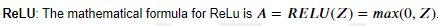
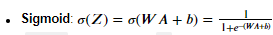
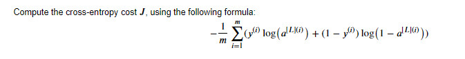
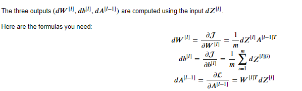
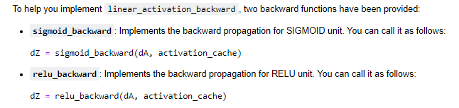
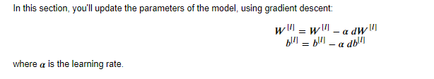

### Introduction

This is an implementation of a  deep L-layer Neural Network. Here ,it is applied to detect images of cats. However, it's application in the real world range from computer vision, speech recognition, natural language processing, machine translation ,and bioinformatics.

## Pipeline
### 1. Import Packages
First, import all the packages you'll need .
numpy is the main package for scientific computing with Python.
matplotlib is a library to plot graphs in Python.
np.random.seed(1) is used to keep all the random function calls consistent.

### 2. Outline 
To build your neural network, several "helper functions have been implemented ." These helper functions will be used to build an L-layer neural network.

 Here's an outline of the steps in this assignment:


1.Initialize the parameters for an  𝐿 -layer neural network </br>
2.Implement the forward propagation module </br>
3.Complete the LINEAR part of a layer's forward propagation step (resulting in  𝑍[𝑙] ).</br>
4.The ACTIVATION function is provided for you (relu/sigmoid)</br>
5.Combine the previous two steps into a new [LINEAR->ACTIVATION] forward function.</br>
6.Stack the [LINEAR->RELU] forward function L-1 time (for layers 1 through L-1) and add a [LINEAR->SIGMOID]</br>at the end (for the final layer  𝐿 ). This gives you a new L_model_forward function.</br>
7.Compute the loss</br>
8.Implement the backward propagation module (denoted in red in the figure below)</br>
9.Complete the LINEAR part of a layer's backward propagation step</br>
10.The gradient of the ACTIVATE function is provided for you(relu_backward/sigmoid_backward)</br>
11.Combine the previous two steps into a new [LINEAR->ACTIVATION] backward function</br>
12.Stack [LINEAR->RELU] backward L-1 times and add [LINEAR->SIGMOID] backward in a new L_model_backward function</br>
13.Finally, update the parameters</br>


### 3. Intialize parameters

Use random initialization for the weight matrices. Use np.random.randn(shape) * 0.01.
Use zeros initialization for the biases. Use np.zeros(shape).
You'll store  𝑛[𝑙] , the number of units in different layers, in a variable layer_dims

### 4. Forward Propagation
#### Linear Forward


#### Linear Activation Forward
Both ReLu and Sigmoid </br>
 </br>
 </br>

#### L-model Forward

Run ReLu L-1 times and then Sigmoid on the L layer

### 5. Cost Function


### 6. Backward Propagation
Now, similarly to forward propagation,it is built in three steps

a.LINEAR backward  </br>
b.LINEAR -> ACTIVATION backward where ACTIVATION computes the derivative of either the ReLU or sigmoid activation </br>
c.[LINEAR -> RELU]  ×  (L-1) -> LINEAR -> SIGMOID backward (whole model) </br>
#### Linear Backward

#### Linear Activation Backward


#### L-model Backward
When we implemented the L_model_forward function, at each iteration, we stored a cache which contains (X,W,b, and z). In the back propagation module, we'll use those variables to compute the gradients. Therefore, in the L_model_backward function, we'll iterate through all the hidden layers backward, starting from layer  𝐿 . On each step, we will use the cached values for layer  𝑙  to backpropagate through layer  𝑙 .</br>

To backpropagate through this network, Your code thus needs to compute </br>
 </br>
To do so, use this formula, </br>
``` python
dAL = - (np.divide(Y, AL) - np.divide(1 - Y, 1 - AL)) # derivative of cost with respect to AL
```
</br>You can then use this post-activation gradient dAL to keep going backward. After that, you will have to use a for loop to iterate through all the other layers using the LINEAR->RELU backward function. You should store each dA, dW, and db in the grads dictionary.

### 7. Update Parameters
 </br>